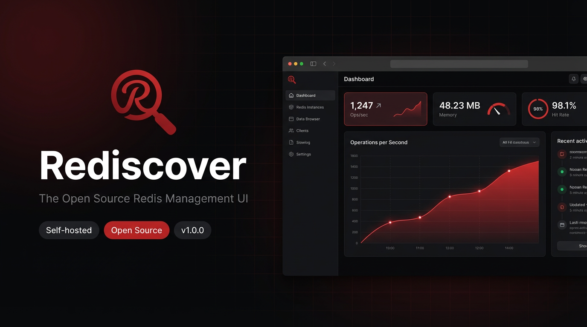

<div align="center">



<br/>
<br/>

# Rediscover

**Self-hosted Redis management tool with a beautiful web interface**

[](https://opensource.org/licenses/MIT)
[](https://nodejs.org)
[](https://hub.docker.com/r/mufazmi/rediscover)
[](https://redis.io)
[](https://www.npmjs.com/package/@mufazmi/rediscover)

<br/>

A modern, feature-rich Redis management application with real-time monitoring,  
key management, and advanced operations — all from a clean, responsive web interface.

<br/>

[**⚡ Quick Start**](#-quick-start) · [**📦 Installation**](#-installation) · [**⚙️ Configuration**](#️-configuration) · [**🔧 Troubleshooting**](#-troubleshooting) · [**📖 Docs**](https://github.com/mufazmi/rediscover/wiki)

<br/>

</div>

---

## ✨ Features

| | Feature | Description |
|---|---|---|
| 📊 | **Real-time Monitoring** | Live stats, memory usage, and performance metrics via WebSocket |
| 🗝️ | **Key Management** | Browse, search, edit, and delete keys across all Redis data types |
| 🔐 | **Secure Authentication** | JWT-based auth with role-based access control |
| 🌐 | **Multi-Connection** | Manage multiple Redis instances from a single interface |
| 📱 | **Responsive Design** | Works on desktop, tablet, and mobile — built with Tailwind CSS + Radix UI |
| ⚡ | **High Performance** | Optimized loading and caching for large-scale deployments |
| 🎨 | **Modern UI** | Clean, intuitive interface — no clutter, no complexity |
| 🔧 | **Easy Configuration** | Setup via environment variables or the built-in UI |

---

## ⚡ Quick Start

Get Rediscover running in under a minute:

**NPM**
```bash
npm install -g @mufazmi/rediscover && rediscover
```

**Docker**
```bash
docker run -d -p 3000:3000 -p 3001:3001 mufazmi/rediscover:latest
```

Then open **http://localhost:3000** in your browser. ✅

---

## 📦 Installation

### System Requirements

<table>
<tr>
<th>Method</th>
<th>Requirement</th>
<th>Version</th>
</tr>
<tr>
<td rowspan="2"><b>NPM</b></td>
<td>Node.js</td>
<td>≥ 18.0.0</td>
</tr>
<tr>
<td>npm</td>
<td>≥ 8.0.0</td>
</tr>
<tr>
<td rowspan="2"><b>Docker</b></td>
<td>Docker</td>
<td>≥ 20.10.0</td>
</tr>
<tr>
<td>Docker Compose</td>
<td>≥ 2.0.0 <i>(optional)</i></td>
</tr>
<tr>
<td rowspan="2"><b>All Methods</b></td>
<td>Redis Server</td>
<td>≥ 5.0.0</td>
</tr>
<tr>
<td>RAM</td>
<td>512 MB minimum</td>
</tr>
</table>

---

### Method 1 — NPM *(Recommended)*

```bash
# 1. Install globally
npm install -g @mufazmi/rediscover

# 2. Verify installation
rediscover --version

# 3. Start the app
rediscover
```

Open **http://localhost:3000** — done.

> **Permission error?** Run: `npm config set prefix '~/.npm-global'` and add `~/.npm-global/bin` to your `PATH`.

---

### Method 2 — Docker

**Basic run:**
```bash
docker run -d \
  --name rediscover \
  -p 3000:3000 \
  -p 3001:3001 \
  mufazmi/rediscover:latest
```

**With environment variables:**
```bash
docker run -d \
  --name rediscover \
  -p 3000:3000 \
  -p 3001:3001 \
  -e JWT_SECRET=your-secure-secret \
  -e REDIS_HOST=your-redis-host \
  -e REDIS_PORT=6379 \
  mufazmi/rediscover:latest
```

**Docker Compose** *(recommended for production)*:

```yaml
# docker-compose.yml
version: '3.8'
services:
  rediscover:
    image: mufazmi/rediscover:latest
    ports:
      - "3000:3000"
      - "3001:3001"
    environment:
      - JWT_SECRET=your-secure-secret-key
      - NODE_ENV=production
    restart: unless-stopped

  redis:
    image: redis:7-alpine
    ports:
      - "6379:6379"
    restart: unless-stopped
```

```bash
docker-compose up -d
```

---

zmi/rediscover/releases):

| Platform | Binary |
|---|---|
| 🪟 Windows | `` |
| 🍎 macOS (Intel) | `` |
| 🍎 macOS (Apple Silicon) | `` |
| 🐧 Linux | `` |

```bash
# macOS / Linux — make executable and run
chmod +x 
sudo mv  /usr/local/bin/rediscover
rediscover
```

---

## ⚙️ Configuration

Create a `.env` file in your working directory:

```env
# ── Server ─────────────────────────────────
PORT=3000
BACKEND_PORT=3001
NODE_ENV=production
HOST=0.0.0.0

# ── Security ────────────────────────────────
JWT_SECRET=your-very-secure-secret-key   # Required in production
JWT_EXPIRATION=24h

# ── Redis Connection ────────────────────────
REDIS_HOST=localhost
REDIS_PORT=6379
REDIS_PASSWORD=your-redis-password
REDIS_TIMEOUT=5000
REDIS_TLS=false

# ── Application ─────────────────────────────
MAX_CONNECTIONS=10
SESSION_TIMEOUT=30
REFRESH_INTERVAL=5
DEBUG=false
```

### Environment Variable Reference

| Variable | Default | Description |
|---|---|---|
| `PORT` | `3000` | Web UI server port |
| `BACKEND_PORT` | `3001` | Backend API server port |
| `NODE_ENV` | `development` | `production` or `development` |
| `HOST` | `localhost` | Bind address (`0.0.0.0` for all interfaces) |
| `JWT_SECRET` | — | **Required in production.** JWT signing secret |
| `JWT_EXPIRATION` | `24h` | Token lifetime (e.g. `1h`, `7d`, `24h`) |
| `REDIS_HOST` | `localhost` | Default Redis hostname or IP |
| `REDIS_PORT` | `6379` | Default Redis port |
| `REDIS_PASSWORD` | — | Redis AUTH password (if set) |
| `REDIS_TIMEOUT` | `5000` | Connection timeout in milliseconds |
| `MAX_CONNECTIONS` | `10` | Max simultaneous Redis connections |
| `REFRESH_INTERVAL` | `5` | Dashboard refresh rate in seconds |
| `SESSION_TIMEOUT` | `30` | Session timeout in minutes |
| `DEBUG` | `false` | Enable verbose debug logging |

> **Tip:** You can also configure Redis connections directly in the web UI — click **Add Connection** and enter your server details.

---

## 🔧 Troubleshooting

<details>
<summary><b>❌ "npm: command not found" or "node: command not found"</b></summary>
<br>

Node.js is not installed. Install it first:

```bash
# macOS
brew install node

# Ubuntu / Debian
sudo apt install nodejs npm

# CentOS / RHEL
sudo yum install nodejs npm
```

Or download directly from [nodejs.org](https://nodejs.org).

</details>

<details>
<summary><b>❌ "Permission denied" during npm install</b></summary>
<br>

```bash
mkdir ~/.npm-global
npm config set prefix '~/.npm-global'
echo 'export PATH=~/.npm-global/bin:$PATH' >> ~/.bashrc
source ~/.bashrc
npm install -g @mufazmi/rediscover
```

</details>

<details>
<summary><b>❌ Port 3000 already in use</b></summary>
<br>

```bash
# Kill process on port 3000
sudo lsof -ti:3000 | xargs kill -9   # macOS / Linux
netstat -ano | findstr :3000          # Windows (then taskkill /PID <PID> /F)

# Or use a different port
PORT=3005 rediscover
```

</details>

<details>
<summary><b>❌ Cannot connect to Redis server</b></summary>
<br>

```bash
# Check if Redis is running
redis-cli ping    # Should return: PONG

# Install Redis if missing
sudo apt install redis-server       # Ubuntu / Debian
brew install redis && brew services start redis   # macOS
sudo yum install redis              # CentOS / RHEL
```

Also check:
- Redis port `6379` is open in your firewall
- `bind` setting in `redis.conf` allows connections from your IP

</details>

<details>
<summary><b>❌ "Authentication failed" to Redis</b></summary>
<br>

- Verify the `requirepass` value in your `redis.conf`
- Ensure `REDIS_PASSWORD` in your `.env` matches
- Test with: `redis-cli -a your-password ping`

</details>

<details>
<summary><b>❌ "Docker: permission denied"</b></summary>
<br>

```bash
sudo usermod -aG docker $USER
newgrp docker   # Apply without logging out
```

</details>

<details>
<summary><b>❌ Container exits immediately</b></summary>
<br>

```bash
# Inspect the logs
docker logs rediscover

# Run interactively for debugging
docker run -it --rm -p 3000:3000 -p 3001:3001 mufazmi/rediscover:latest
```

</details>

<details>
<summary><b>❌ JWT_SECRET warning on startup</b></summary>
<br>

```bash
# Export inline
export JWT_SECRET="your-secure-key"
rediscover

# Or add to .env
echo 'JWT_SECRET=your-secure-key' >> .env
```

</details>

<details>
<summary><b>❌ Blank page or UI not loading</b></summary>
<br>

- Ensure JavaScript is enabled in your browser
- Temporarily disable ad blockers
- Use a modern browser: Chrome 90+, Firefox 88+, Safari 14+
- Open DevTools → Console to check for errors

</details>

**Enable debug mode** for detailed logs:
```bash
DEBUG=true rediscover
```

Still stuck? [Open a GitHub Issue](https://github.com/mufazmi/rediscover/issues) with your OS, Node.js version, install method, and the full error message.

---

## 🛠️ Development

```bash
# Clone the repo
git clone https://github.com/mufazmi/rediscover.git
cd rediscover

# Install dependencies
npm install

# Start dev server
npm run dev

# Run tests
npm test

# Build for production
npm run build
```

---

## 🤝 Contributing

Contributions are welcome — bug fixes, features, and docs all appreciated.

1. Fork the repository
2. Create your branch: `git checkout -b feature/your-feature`
3. Commit your changes: `git commit -m 'Add your feature'`
4. Push: `git push origin feature/your-feature`
5. Open a Pull Request

Please read [CONTRIBUTING.md](CONTRIBUTING.md) before submitting.

---

## 👨‍💻 Author

**Umair Farooqui** — Software Engineer & Certified Ethical Hacker (CEH v13)

[](https://umairfarooqui.com)
[](https://github.com/mufazmi)
[](https://linkedin.com/in/mufazmi)
[](https://hackerone.com/mufazmi)
[](https://medium.com/@mufazmi)
[](mailto:info.umairfarooqui@gmail.com)

### 🏆 Security Recognition

Recognized for responsible disclosure by:

`NASA` · `Dell Technologies` · `Nokia` · `Lenovo` · `Zoom` · `LG` · `ABN AMRO Bank` · `Accenture` · `Paytm` · `U.S. Dept. of Homeland Security` · `WHO` · `United Airlines` · `Drexel University` · `Radboud University`

---

## 📄 License

Released under the [MIT License](LICENSE). Free to use, modify, and distribute.

---

<div align="center">

**Made with ❤️ by [Umair Farooqui](https://github.com/mufazmi)**

*If Rediscover saves you time, consider giving it a ⭐ on GitHub!*

</div># rediscover
